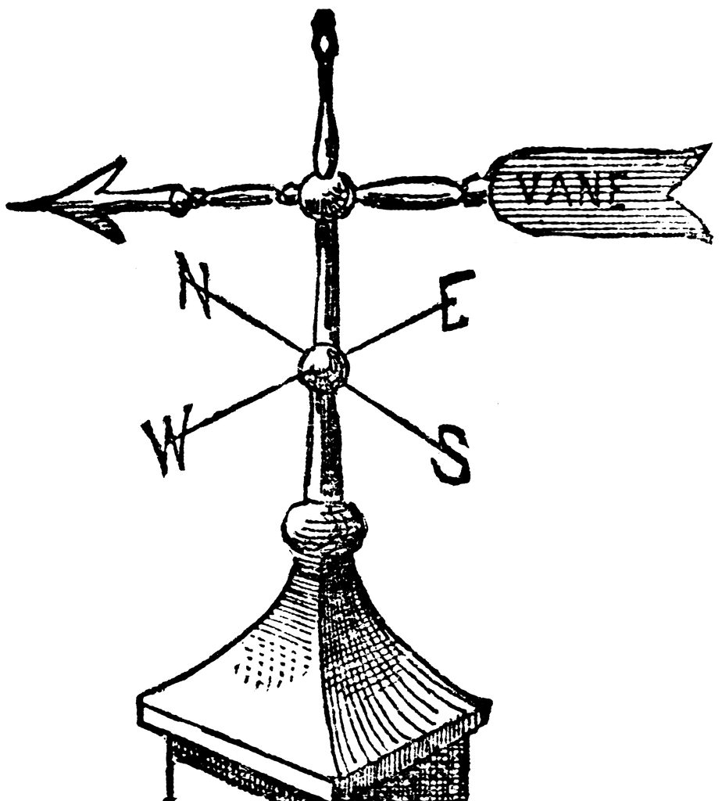

<!--
*** Thanks for checking out this README Template. If you have a suggestion that would
*** make this better, please fork the repo and create a pull request or simply open
*** an issue with the tag "enhancement".
*** Thanks again! Now go create something AMAZING! :D
-->

<!-- PROJECT SHIELDS -->
<!--
*** I'm using markdown "reference style" links for readability.
*** Reference links are enclosed in brackets [ ] instead of parentheses ( ).
*** See the bottom of this document for the declaration of the reference variables
*** for contributors-url, forks-url, etc. This is an optional, concise syntax you may use.
*** https://www.markdownguide.org/basic-syntax/#reference-style-links
-->

[![Contributors][contributors-shield]][contributors-url]
[![Forks][forks-shield]][forks-url]
[![Stargazers][stars-shield]][stars-url]
[![Issues][issues-shield]][issues-url]
[![MIT License][license-shield]][license-url]
[![LinkedIn][linkedin-shield]][linkedin-url]

<!-- PROJECT LOGO -->
 

  

  <h3 align="center">ptt-stock-vane</h3>

  

    一個會告訴你 PTT 股票版鄉民都在想什麼的聊天機器人
     
     
    <a href="#"><strong>View Demo »</strong></a>
     
  

<!-- TABLE OF CONTENTS -->
## Table of Contents

<!-- * [About the Project](#about-the-project)
  * [Built With](#built-with)
* [Getting Started](#getting-started)
  * [Prerequisites](#prerequisites)
  * [Installation](#installation)
* [Usage](#usage)
* [Roadmap](#roadmap)
* [Contributing](#contributing) 
-->

* [License](#license)
* [Contact](#contact)

<!-- * [Acknowledgements](#acknowledgements)-->

<!-- ABOUT THE PROJECT 
## About The Project

[![Product Name Screen Shot][product-screenshot]](https://example.com)

There are many great README templates available on GitHub, however, I didn't find one that really suit my needs so I created this enhanced one. I want to create a README template so amazing that it'll be the last one you ever need.

Here's why:
* Your time should be focused on creating something amazing. A project that solves a problem and helps others
* You shouldn't be doing the same tasks over and over like creating a README from scratch
* You should element DRY principles to the rest of your life :smile:

Of course, no one template will serve all projects since your needs may be different. So I'll be adding more in the near future. You may also suggest changes by forking this repo and creating a pull request or opening an issue.

A list of commonly used resources that I find helpful are listed in the acknowledgements.

### Built With
This section should list any major frameworks that you built your project using. Leave any add-ons/plugins for the acknowledgements section. Here are a few examples.
* [Bootstrap](https://getbootstrap.com)
* [JQuery](https://jquery.com)
* [Laravel](https://laravel.com)

-->

<!-- USAGE EXAMPLES 
## Usage

Use this space to show useful examples of how a project can be used. Additional screenshots, code examples and demos work well in this space. You may also link to more resources.

_For more examples, please refer to the [Documentation](https://example.com)_
-->

<!-- ROADMAP 
## Roadmap

See the [open issues](https://github.com/othneildrew/Best-README-Template/issues) for a list of proposed features (and known issues).
-->

<!-- CONTRIBUTING 
## Contributing

Contributions are what make the open source community such an amazing place to be learn, inspire, and create. Any contributions you make are **greatly appreciated**.

1. Fork the Project
2. Create your Feature Branch (`git checkout -b feature/AmazingFeature`)
3. Commit your Changes (`git commit -m 'Add some AmazingFeature'`)
4. Push to the Branch (`git push origin feature/AmazingFeature`)
5. Open a Pull Request
-->

<!-- LICENSE -->
## License

Distributed under the MIT License. See `LICENSE` for more information.

<!-- CONTACT -->
## Contact

Email - uncleben006@gmail.com

Project Link: [https://github.com/uncleben006/ptt-stock-vane](https://github.com/uncleben006/ptt-stock-vane)

<!-- ACKNOWLEDGEMENTS 
## Acknowledgements
* [GitHub Emoji Cheat Sheet](https://www.webpagefx.com/tools/emoji-cheat-sheet)
* [Img Shields](https://shields.io)
* [Choose an Open Source License](https://choosealicense.com)
* [GitHub Pages](https://pages.github.com)
* [Animate.css](https://daneden.github.io/animate.css)
* [Loaders.css](https://connoratherton.com/loaders)
* [Slick Carousel](https://kenwheeler.github.io/slick)
* [Smooth Scroll](https://github.com/cferdinandi/smooth-scroll)
* [Sticky Kit](http://leafo.net/sticky-kit)
* [JVectorMap](http://jvectormap.com)
* [Font Awesome](https://fontawesome.com)
-->

<!-- MARKDOWN LINKS & IMAGES -->
<!-- https://www.markdownguide.org/basic-syntax/#reference-style-links -->
[contributors-shield]: https://img.shields.io/github/contributors/uncleben006/ptt-stock-vane.svg?style=flat-square
[contributors-url]: https://github.com/uncleben006/ptt-stock-vane/graphs/contributors

[forks-shield]: https://img.shields.io/github/forks/uncleben006/ptt-stock-vane.svg?style=flat-square
[forks-url]: https://github.com/uncleben006/ptt-stock-vane/network/members

[stars-shield]: https://img.shields.io/github/stars/uncleben006/ptt-stock-vane.svg?style=flat-square
[stars-url]: https://github.com/uncleben006/ptt-stock-vane/stargazers

[issues-shield]: https://img.shields.io/github/issues/uncleben006/ptt-stock-vane.svg?style=flat-square
[issues-url]: https://github.com/uncleben006/ptt-stock-vane/issues

[license-shield]: https://img.shields.io/github/license/uncleben006/ptt-stock-vane.svg?style=flat-square
[license-url]: https://github.com/uncleben006/ptt-stock-vane/blob/master/LICENSE.txt

[linkedin-shield]: https://img.shields.io/badge/-LinkedIn-black.svg?style=flat-square&logo=linkedin&colorB=555
[linkedin-url]: https://linkedin.com/in/uncleben006

[product-screenshot]: images/screenshot.png
